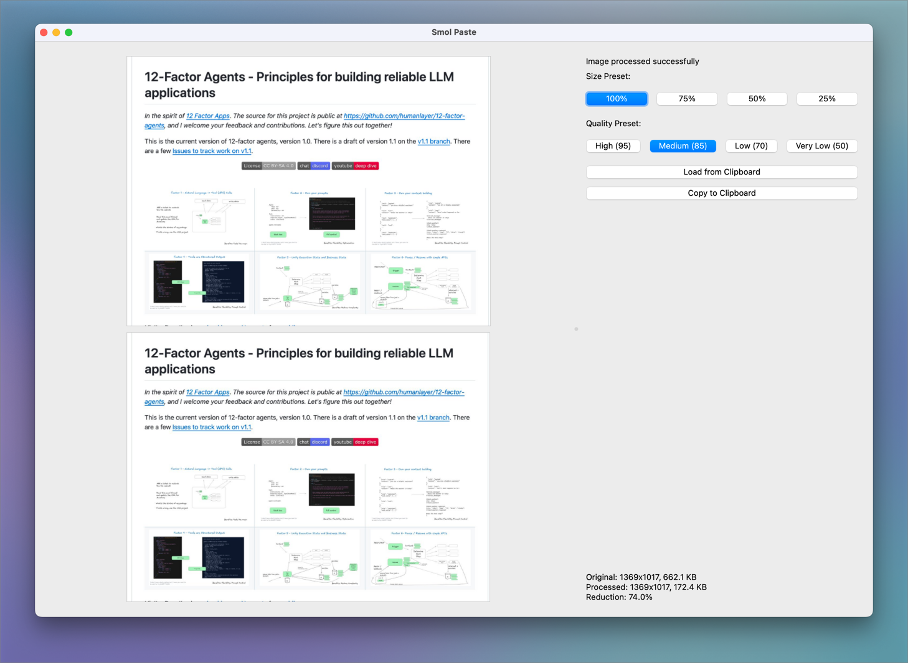

# Smol Paste

Smol Paste is a simple, modern clipboard image optimizer with a PyQt6 GUI. It allows you to quickly load images from your clipboard, resize and compress them using preset options, and copy the optimized image back to your clipboard for easy pasting.



## Features

- Load images directly from your clipboard
- Resize images using preset size options (100%, 75%, 50%, 25%)
- Compress images with quality presets (High, Medium, Low, Very Low)
- Compare original and processed images side-by-side
- Copy optimized images back to the clipboard
- View image statistics (dimensions, file size, reduction percentage)
- Modern, responsive PyQt6 interface

---

## Installation

1. **Clone the repository:**
   ```sh
   git clone https://github.com/yourusername/smol-paste.git
   cd smol-paste
   ```
2. **Install dependencies:**
   ```sh
   pip install -r requirements.txt
   ```
   Ensure you have Python 3.8+ and PyQt6 installed.

---

## Usage

Run the application:
```sh
python -m src.smol_paste.smol_paste
```

- Click "Load from Clipboard" to load an image from your clipboard.
- Use the size and quality preset buttons to adjust the image.
- View the original and processed images side-by-side.
- Click "Copy to Clipboard" to copy the optimized image.

---

## Development

- The main application code is in `src/smol_paste/smol_paste.py`.
- Tests are located in `tests/test_smol_paste.py`.
- To run tests:
  ```sh
  pytest
  ```
- For development workflow details, see [development.md](development.md).

---

## License

MIT License. See [LICENSE](LICENSE) for details.
